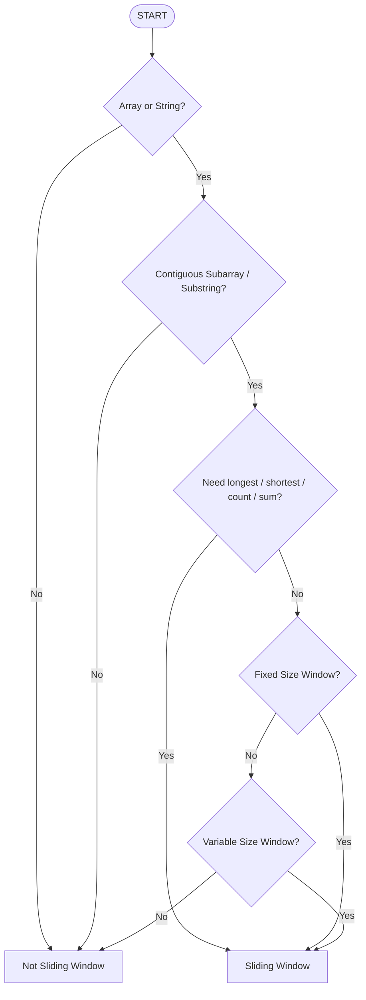

# What is the Sliding Window Pattern?

The Sliding Window technique is used to process **contiguous subarrays or substrings** efficiently by maintaining a window of elements and moving it across the data structure instead of repeatedly recalculating results.

It helps reduce time complexity from `O(n²)` to `O(n)` in many range-based problems.

**Main Idea** : Expand the window to include new elements and shrink it when needed, while maintaining useful information about the current window.

## WHEN to Use Sliding Window (Mind Map / Flowchart)



## Keyword Triggers (Spot in Problem Statement)

- **Subarray** • **Substring** • **Contiguous** • **Longest / Shortest**
- **Maximum / Minimum** • **Window Size = K** • **At Most K**
- **At Least K** • **Exactly K** • **Count Distinct Elements**
- **Frequency of Characters** • **Repeated Characters** • **Consecutive Elements**

## Types of Sliding Window

### 1. Fixed Size Window

Window size remains constant.

**Examples**

* Maximum sum subarray of size `K`
* First negative integer in every window of size `K`
* Maximum element in every window of size `K`

```text
[L L L]
  [L L L]
    [L L L]
```

### 2. Variable Size Window

Window size expands and shrinks based on a condition.

**Examples**

* Longest substring without repeating characters
* Minimum size subarray sum
* Longest repeating character replacement
* Fruit Into Baskets

```text
[L L]
[L L L]
[L L L L]
  [L L]
```

## General Template

### Fixed Size Window

```cpp
int left = 0;

for(int right = 0; right < n; right++) {

    // Add current element

    if(right - left + 1 == k) {

        // Process current window

        // Remove left element
        left++;
    }
}
```

### Variable Size Window

```cpp
int left = 0;

for(int right = 0; right < n; right++) {

    // Add current element

    while(condition_not_valid) {

        // Remove left element
        left++;
    }

    // Update answer
}
```

## How to Identify Sliding Window Quickly?

Ask these questions:

1. Is the data structure an **array or string**?
2. Is the problem asking about a **contiguous range**?
3. Do I need **longest, shortest, maximum, minimum, count, or sum**?
4. Can I avoid recalculating by reusing information from the previous range?

If the answer is mostly **YES**, think **Sliding Window**.

## When NOT to use Sliding Window

* **Non-contiguous subsequences**
* **Random pair selection**
* **Graphs or Trees**
* **Order-independent problems**
* **Problems requiring all combinations**
* **Sorting-based pair problems (usually Two Pointers)**
