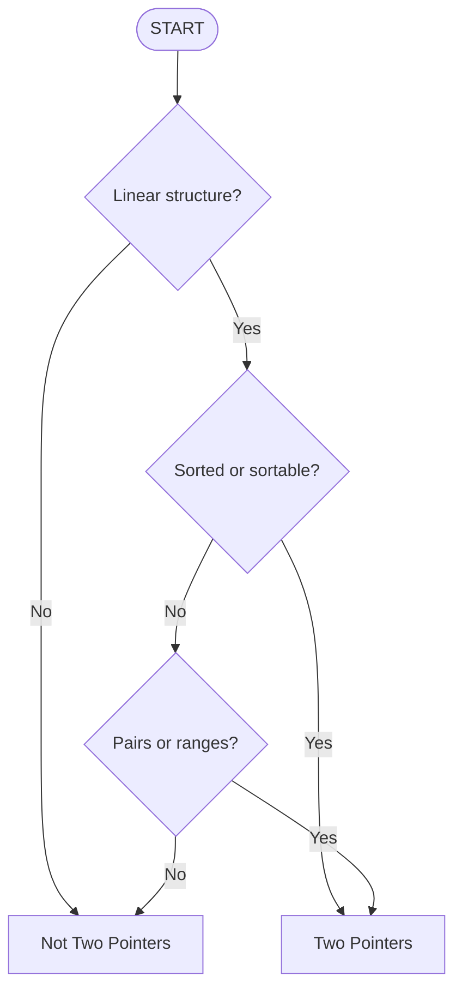

## What is the Two Pointers Pattern?
The Two Pointers technique uses two indices to traverse a linear data structure (array / string / linked list) in a single pass, 
reducing time complexity from `O(n²)` to `O(n)`.

**Main Idea** : Use two indices to shrink the search space intelligently instead of re-checking elements.

## WHEN to Use Two Pointers (Mind Map / Flowchart)

## Keyword Triggers (Spot in Problem Statement)

- **Sorted array / string** • **Pair / target sum** • **Closest / minimum difference** • **Remove duplicates**
- **In-place** • **Palindrome** • **Reverse** • **Merge sorted arrays**
- **Compare from both ends** • **Detect Cycle**

## When NOT to use Two Pointers
- **Order matters and array is unsorted** • **Non-Linear Data Structure**
