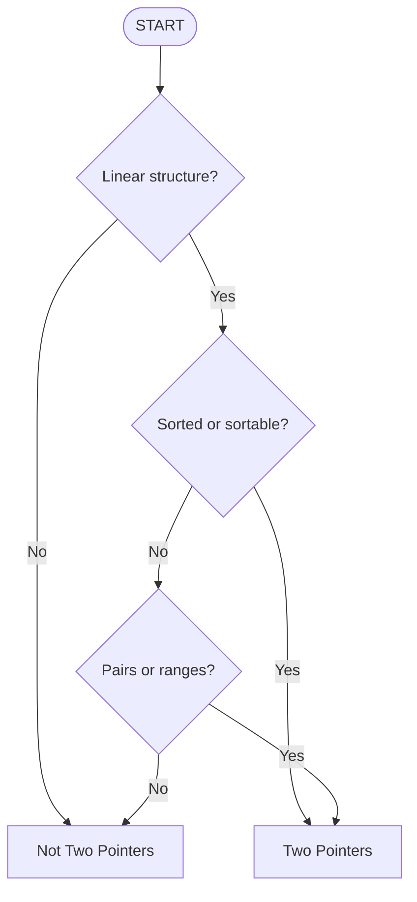

## What is the Two Pointers Pattern?
The Two Pointers technique uses two indices to traverse a linear data structure (array / string / linked list) in a single pass, 
reducing time complexity from `O(n²)` to `O(n)`.

**Main Idea** : Use two indices to shrink the search space intelligently instead of re-checking elements.

## WHEN to Use Two Pointers (Mind Map / Flowchart)


```mermaid
flowchart TD
    A([START]) --> B{Linear structure?}
    B -- No --> E[Not Two Pointers]
    B -- Yes --> C{Sorted or sortable?}
    C -- Yes --> D[Two Pointers]
    C -- No --> F{Pairs or ranges?}
    F -- Yes --> D
    F -- No --> E
```

## Keyword Triggers (Spot in Problem Statement)

- **Sorted array / string** • **Pair / target sum** • **Closest / minimum difference** • **Remove duplicates**
- **In-place** • **Palindrome** • **Reverse** • **Merge sorted arrays**
- **Compare from both ends** • **Detect Cycle**

## Types of Two Pointers

### 1. Opposite Direction Pointers

Pointers start from both ends and move toward each other.

**Examples**

* Two Sum II (Sorted Array)
* Valid Palindrome
* Container With Most Water
* 3Sum (after sorting)

```text
L           R
1 2 3 4 5 6 7
```

---

### 2. Same Direction Pointers

Both pointers move in the same direction, usually with one pointer leading the other.

**Examples**

* Remove Duplicates from Sorted Array
* Move Zeroes
* Remove Element

```text
L R
1 1 2 2 3 4
```

---

### 3. Fast & Slow Pointers

One pointer moves faster than the other.

**Examples**

* Linked List Cycle
* Find Middle of Linked List
* Happy Number

```text
Slow -> 1 step
Fast -> 2 steps
```

---

### 4. Multiple Pointers

More than two pointers are used together.

**Examples**

* 3Sum
* 4Sum
* Dutch National Flag Problem

```text
i    L    R
```

## General Templates

### Opposite Direction Template

```cpp
int left = 0;
int right = n - 1;

while(left < right) {

    if(condition_met) {
        // Process answer
    }

    if(need_larger_value)
        left++;
    else
        right--;
}
```

### Same Direction Template

```cpp
int left = 0;

for(int right = 0; right < n; right++) {

    // Process current element

    while(condition_not_valid) {
        left++;
    }
}
```

### Fast & Slow Pointer Template

```cpp
ListNode* slow = head;
ListNode* fast = head;

while(fast && fast->next) {

    slow = slow->next;
    fast = fast->next->next;
}
```

## How to Identify Two Pointers Quickly?

Ask these questions:

1. Is the data structure linear (array, string, linked list)?
2. Am I comparing elements from both ends?
3. Am I searching for a pair, range, or relationship between indices?
4. Can I avoid nested loops by moving pointers intelligently?
5. Is the array sorted or can it be sorted first?

If the answer is mostly **YES**, think **Two Pointers**.

## When NOT to use Two Pointers
- **Order matters and array is unsorted** • **Non-Linear Data Structure**
